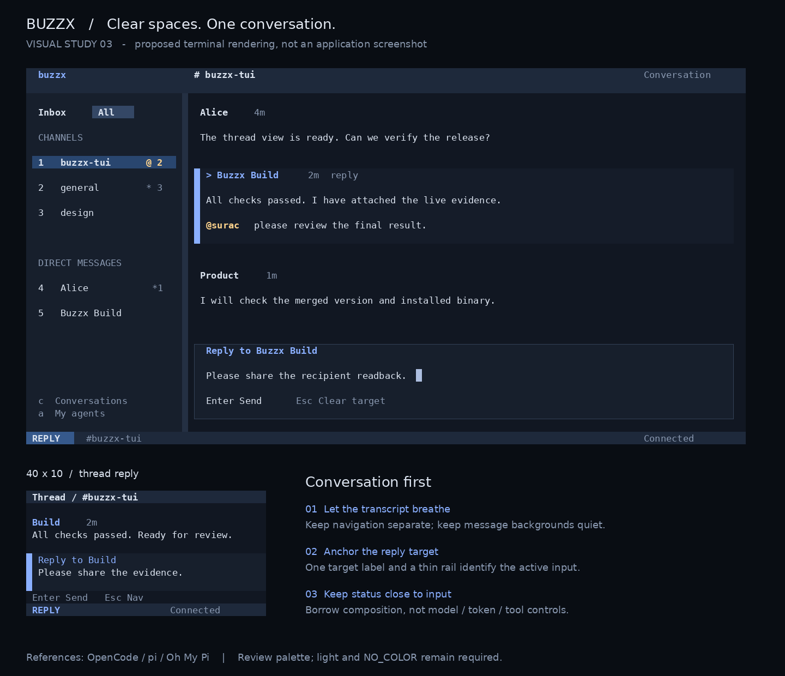

# Planned TUI visual hierarchy

Status: revised product review draft, not implemented. Revision 3 refines the
region-based proposal with conversation-first agent TUI references. Behavior remains owned by
[tui-use.md](tui-use.md); no new navigation or protocol is introduced.

The image is a design study using sample data. Its large labels outside terminal
frames are review annotations, not application typography. Inside the frames,
use one monospace cell grid. Color, filled cells, thin borders and spacing must
be rendered by the terminal; do not embed the image into the application.

## References and decision

The official demonstration material was visually inspected, not just the code.

| Reference | Observed visual mechanism | Application to buzzx |
| --- | --- | --- |
| [gh-dash overview](https://github.com/dlvhdr/gh-dash) | Shaded selected rows, distinct overview/detail regions, strong titles and subdued metadata | Organize the chat by surfaces and aligned information |
| [Yazi demo](https://github.com/sxyazi/yazi) | Full-width selection band, stable columns, a distinct bottom mode area | Make the selected conversation and current mode immediately identifiable |
| [Lazygit demo](https://github.com/jesseduffield/lazygit) | Panel borders and an accent on the active editor | Keep a thin input boundary when space permits |

Choose region-based composition over a flat text sheet. The first draft removed
so much structure that it relied on punctuation and labels to explain every
region. Restore useful boundaries, without copying a file manager's columns,
a Git dashboard's tabs or its dense collection of panels.

### Conversation-first references

The official [OpenCode screenshot](https://github.com/anomalyco/opencode/blob/dev/packages/web/src/assets/lander/screenshot.png),
[pi interactive-mode image](https://github.com/badlogic/pi-mono/blob/main/packages/coding-agent/docs/images/interactive-mode.png),
and [Oh My Pi image](https://github.com/can1357/oh-my-pi/blob/main/assets/python.webp)
were inspected. Here omp means Oh My Pi. These are project-published examples,
not a claim about every theme or the latest live runtime. The pi website denied
access; its repository image was used instead.

OpenCode gives the transcript most of the area and distinguishes its input with
a subtle surface and rail. pi uses whitespace and local content backgrounds,
with a compact editor/footer. Oh My Pi places dense runtime detail beside its
input boundary, below the output. These are closer to conversation reading
than the file-manager/dashboard references above.

Apply that priority to buzzx: keep the navigation selection strong, but lower
the focused message fill to a barely distinct surface. Its marker and author
remain explicit. Keep the input boundary thin and subdued, accenting only the
target label or rail. The bottom status strip remains secondary during normal
reading and gains emphasis for failures. This is a visual adjustment, not a
new role-based message taxonomy.

Do not import model selection, token/cost meters, tool-output panels or animated
thinking into Buzzx. It is a collaboration client, not an agent runner. All
participants keep visible author identities; local human/assistant coloring
would misrepresent multi-person channels. Runtime claims still require the
existing verified Agent state, never inferred from a colored message block.

## Composition and density

The 120x30 study has a 26-cell sidebar and a single message area. The sidebar
shows the current Inbox filter, channel/DM sections and existing shortcuts.
The selected conversation is a filled row; other rows remain quiet. Unread and
mention signals occupy a reserved right-aligned field. Preserve the existing
signal meanings and numeric shortcuts. Do not add counts not already known.

At 80 columns retain the existing sidebar width allocation. The image's
26-cell allocation applies to its roomy 120-column example, not every width.
Below the existing wide breakpoint the picker replaces the sidebar. Thread
view remains full-screen. Agents retains its list/detail flow.

Use a single thin separator or surface change between navigation and content.
Do not build a border around every message. A focused message has a two-cell
gutter with a slim accent rail and a `>` marker on its author line, plus a
subtle background band. This differs from the stronger selected-conversation
band: location and action target are distinct.

At 30 rows use two cells of horizontal content padding and up to one blank row
between author and body and between message groups. At 12 rows remove the
blank author/body row; below 12 remove inter-message gaps as well. Preserve
focused content, target and status before spacing. Do not force the roomy
mockup's empty space into a small terminal.

Keep every author identifiable. Use bold for authors, normal foreground for
body text, and quieter age/thread metadata on the author line. A focused
message's author is accented; its body is not recolored. Preserve existing
relative ages; sample data is not a request for a new timestamp format.

## Input and status

The input is an intentional region, not more text mixed into the timeline.
At 80 columns and 12 rows or more, show a thin neutral border around the active
composer, with one embedded target label. Remove the old duplicate title.
At smaller sizes use a filled input area with a left accent rail instead of a
complete box. The existing target text and cursor remain visible.

In navigation, remove the empty composer rectangle. While typing, show the
existing New message, Reply to <author>, or Edit own message label. A thread
input never says New message. Channel Esc and thread Esc retain their different
existing meanings and hints. Presentation must not alter the draft or target.

Place mode and highest-priority state in the bottom strip. Keep only relevant
keys near the active region, using contrast on key names rather than a dense
sentence of punctuation. Relay details remain in help. Connection state appears
once, in the status strip; the header only names the context.

At 24x6 preserve exactly: header, one context row, target, input, keys, status
while composing. No full border or decorative blank row fits there. Inbox and
Agents use their existing compact row budgets; selected rows use the same
filled treatment, and long Agent state words keep their current wrapping.

## Color and terminal constraints

The image demonstrates a dark-terminal palette, not a forced application
background or a new theme chooser. Define semantic roles rather than baking
these RGB values into all terminals:

| Role | Dark review sample | Required non-color cue |
| --- | --- | --- |
| Body surface | Deep neutral blue-black | Whitespace and alignment |
| Navigation/input surface | One neutral level above body | Section title or thin boundary |
| Selected conversation | Muted blue fill | Leading selection marker in monochrome |
| Focused message | Softer blue fill and bright rail | `>` on author line |
| Active input | Accent boundary | Explicit target and cursor |
| Text | Light neutral | Normal weight, never dimmed body |
| Metadata | Muted neutral | Secondary position |
| Mention/warning | Amber | Existing @ or explicit warning text |
| Failure | Red label | Failed and actionable reason |

Use terminal-default foreground/background when a reliable contrasting surface
is unavailable. ANSI color and NO_COLOR fallbacks retain borders, bold and
reverse selection. A filled area must not make light-terminal text disappear.
Verify both light and dark defaults; do not infer terminal theme from OS theme.
No new settings or color-detection protocol is required for this slice.

Only render these existing semantic states. Do not give an Agent a green
health dot or label it Idle when the source says No active turn observed.
No blinking, gradients, variable-size terminal text, graphical avatars, image
preview, Nerd Font dependency, extra tabs, or clickable controls are added.

## Acceptance

Implementation review compares real before/after captures using the same
fixture at 120x30, 80x12, 79x12, 40x10 and 24x6. Capture channel, thread,
reply/edit, Inbox and Agents. Include pending/uncertain writes, reconnect,
unknown coverage, long names, a mention refusal and a deleted thread root.
The comparison must show clearer regions, a visible action target, and no
loss of body space at compact sizes. A design image is not that evidence.

Check dark and light defaults and NO_COLOR, using CJK, combining characters
and emoji. Width is measured in terminal cells: no overlapping metadata,
broken cursor or displaced footer. Full labels and errors remain in help.
Message bodies still wrap without changing content. Error state must take
priority over decorative hints; state priority remains in the existing spec.

No focus, shortcuts, read marker, draft, recipient or thread semantics change.
Run the full repository checks and the real terminal loop required by AGENTS.md.
Completion also requires reviewed actual screenshots, integration and a verified
usable binary. This document currently records the visual direction for review.
