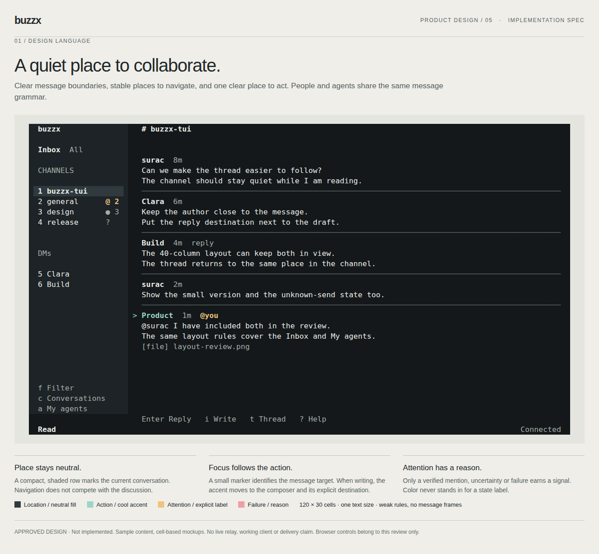

# TUI visual language

Status: revision 5, approved for implementation on 2026-09-27. Not implemented.
This is the implementation baseline, including the approved weak message
separators. It replaces revisions 1-4; previous images remain historical artifacts.
The [review atlas](assets/tui-design-system.html) contains four boards and dark,
light and NO_COLOR studies. Its controls are for reviewing the design, not new
client controls. Sample messages and Agent states are invented fixtures.

## Product character

buzzx is a quiet place to collaborate from a terminal. People read a shared
conversation, decide what needs their attention, and write to an explicit
destination. The visual language should make those three acts recognizable
without giving every message a panel or every Agent a special treatment.

The UI is calm in normal use, precise about identity and destination, and
explicit when its knowledge is incomplete. A conversation is the primary
surface. Navigation supports it; runtime information does not take it over.
This follows the [product contract](../core.md).

## Scope and authority

Implement this visual language across the channel/DM timeline, focused thread,
composer, Inbox picker, Agent list/detail and help. All pages use the same
styles, spacing and selection rules. Do not stop at the main channel screen.

This document owns visual appearance and density. [The manual](tui-use.md)
owns keys, focus, drafts, recipients and state meanings;
[the render contract](../design/render-contract.md) owns rows and overlays.
Existing ASCII layouts in the manual explain behavior, not the final styling.
This spec and its revision-5 atlas are the appearance baseline.

No new control surface, setting, theme picker, navigation command, message
grouping, protocol, read-state rule or Agent capability is added. A visual
separator cannot merge two events, introduce a selectable item or imply that
a task or thread has finished. The application remains a terminal chat client.

## Shared anatomy

Every view has four stable positions: context at the top, content in the
remaining space, available keys near the bottom, and the highest-priority state
on the last row. A composer occupies the bottom of content only while writing.
Help and overlays replace the active surface; they do not introduce another
permanent column. The current [keys and behavior](tui-use.md) remain authoritative.

| Surface | Context | Main content | Action destination |
| --- | --- | --- | --- |
| Channel or DM | Conversation name | Continuous timeline, sidebar in wide mode | New message or explicit reply/edit target |
| Thread | Conversation / Thread | Root and replies in one timeline | Explicit root, reply or edit target |
| Inbox picker | Inbox / active filter | Channels and DMs with one selection | Selected conversation |
| My agents | My agents | Names and observed states | Selected Agent's details |
| Agent detail | My agents / name | State, evidence age, accessible contexts | Selected accessible channel |
| Help | Help / current context | Full labels, reasons and available keys | Return to previous view |

The channel sidebar is the embedded Inbox list. Opening the picker enlarges
that same list, not a separate product. Agent detail uses the same selection
row for accessible contexts. Unavailable contexts remain plain, non-actionable
text. These views do not gain search fields, tabs or management buttons.

## Visual grammar

Three meanings use different treatments. They may coexist without merging:

- **Place:** the current conversation has a neutral filled selection row. Its
  name also appears in the context header. It never gets the action accent.
- **Action:** in reading mode a two-cell gutter with `>` and an accented author
  identifies the targeted row. In writing mode emphasis moves to the composer
  target and cursor; the timeline keeps ordinary author styling. The saved row
  focus still exists but no longer competes visually with the active editor.
- **Attention:** a direct mention uses the verified row's `@you` label and the
  Inbox's existing signal. Unknown, stale and failed states have explicit words.
  Their treatment survives selection and does not tint the message body.

An Inbox, Agent or context list has one filled selected row and a leading `>`
when it is the active picker. The embedded sidebar uses its existing number
slot; reverse video supplies a non-color selection cue. In the timeline a
message is never a full-width inverse block or a filled card. Focus moves
without changing its line count or padding.

While composing, the target describes where the draft will go. It is not
inferred from the author nearest the bottom of the timeline. A reply target
does not mean that author will receive a notification. Mention styling follows
signed recipients, not a string that merely resembles an `@name`.

## Type, spacing and alignment

Use the terminal's single monospace size. Author and context labels are bold;
body text is normal foreground; age, reply metadata and hints are secondary.
All authors use the same treatment. No synthetic human/assistant bubble style,
role color, avatar or inferred bot badge is added.

An author line is immediately followed by its body, always on the same left
edge. A roomy timeline has at least 40 terminal columns and 16 terminal rows;
all other supported sizes use compact spacing. This is a density choice, not
a new navigation breakpoint. Roomy timelines use one separator row between
messages; compact timelines use no extra separator row. Lists may have one
intervening blank row in roomy mode, but do not inherit timeline separators.
Existing newlines in message content are content and are not removed.

The channel sidebar stays 22 cells wide. Content starts with a two-cell focus
gutter and one additional cell after the sidebar; an overlay uses a two-cell
outer inset plus its focus gutter. At widths below 40, reduce outer padding
before reducing body width. At 24 columns, padding can be zero. At 24x6,
composition uses exactly the six rows illustrated in the density studies.

A compact composer uses one target row immediately followed by one input row.
A roomy composer uses one target row, one blank row and two input rows. Keep
the cursor visible within that fixed input allocation as the draft grows;
the buffer itself is not clipped or shortened. Use the terminal cursor at the
insertion point; the block in the mockup illustrates it, not a second cursor.
Use one neutral input surface and a short left rule beside its target, with no
full box border. At minimal widths, the target and cursor suffice.

Conversation signal slots retain the existing five-cell reservation. Names
shorten only after allocating their state. In an Agent list, align state words
at a common column where they fit; otherwise wrap the state under the name.
Do not abbreviate `No active turn observed` to a different claim. Message
bodies wrap; labels may clip; complete names and reasons remain in help/detail.
Measure terminal cells, including wide and combining characters.

## Message separators

Ordinary messages have no complete frame or card. A weak horizontal rule
clarifies where one message ends and the next starts. It uses the neutral
separator role, never the focus, mention or error color. Do not brighten it
when a message is focused, mentioned, pending or uncertain.

- **Roomy timeline:** replace the single gap between adjacent messages with
  one rule row. Start at the body left edge and end at the content right inset;
  do not cross the focus gutter or sidebar. The rule follows the entire message,
  including attachment and reaction lines, and precedes the next author. Do not
  add another gap above or below it, or a rule before the first/after the last
  message in the loaded sequence.
- **Compact timeline:** allocate the author, age and semantic labels first.
  If at least six cells remain, leave two spaces and fill the remainder with
  the rule (at least four strokes). Otherwise omit it. Never clip a name,
  state or body just to fit decoration. The rule cannot wrap to another row.
- **Minimal one-row excerpt:** where the existing compact view combines an
  author and body in one row, omit the rule. At 24x6 the input context needs
  that space. A header-only row may still use the compact rule if space permits.

A separator is presentational spacing, not a row/event of its own. It cannot
receive focus, advance read progress, count as a reply or be a write target.
When the viewport starts inside a message, do not fabricate a new message
boundary. A rule scrolls with the actual boundary, not as a sticky screen edge.
Incoming messages and switching density must preserve the focused event.

Use a single-cell horizontal stroke, such as `─`; ASCII `-` is acceptable when
that glyph is unavailable. In NO_COLOR use default foreground with dim styling
where supported, never reverse, bold or an attention marker. If dim is not
supported, a plain neutral stroke is sufficient; author weight and position
still distinguish the message. Keep the focused author and meaningful labels
stronger than the decoration. Consecutive messages by the same author retain
separate headers and the same rule: no new grouping behavior is introduced.

The input's short vertical rule identifies the active writing region. It does
not wrap the draft in a message frame. Inbox, Agents and help retain their
existing list/section grouping; they do not put a horizontal line after every
item. This keeps boundaries consistent with the type of content.

## Region budgets

Reserve from the bottom before laying out the timeline. Every supported view
has a one-row context header, one keys row and one state row. In minimal mode
the state word can replace a redundant mode word. The remaining rows are
content; reading mode has no reserved empty composer.

| Density | Composer allocation | Timeline allocation while composing |
| --- | --- | --- |
| Roomy | Target 1 + gap 1 + input 2 | Remaining height after header, keys and state |
| Compact | Target 1 + input 1 | Remaining height after header, keys and state |
| 24x6 minimum | Target 1 + input 1 | Exactly 1 context row |

The channel typing line may take one additional row only when at least one
context row remains. Otherwise omit that decorative activity line for the
frame, retaining its existing state and sidebar signal. A thread never labels
channel typing as thread activity. Full errors must not replace the target or
input; expose the short reason in the state row and full detail through help.

At 24x6, composing is exactly: header, context, target, input, keys, state.
At that size, reading has three content rows. At 80x12 a channel still keeps
its 22-cell sidebar; at 79x12 the existing one-column navigation applies. A
thread and overlays remain full-screen at both widths. Below the supported
minimum, show the existing size message and preserve state for the next resize.

## Palette and terminal defaults

Color reinforces a structure that is already legible without it. The following
are controlled review values, not a theme setting or a requirement to override
the user's terminal background. There are three neutral surfaces and three
semantic foreground accents and one decorative rule role; there are no
per-page palettes.

| Role | Dark study | Light study | No reliable palette / NO_COLOR |
| --- | --- | --- | --- |
| Canvas / body | `#14181a` / `#e7ebe8` | `#fafaf7` / `#25332e` | Terminal defaults |
| Navigation / input surface | `#1d2326` | `#eeefeb` | Default background, spacing and target label |
| Selected list row | `#303a3e` | `#dce3de` | Reverse default foreground/background |
| Secondary text | `#a1ada8` | `#56645e` | Default foreground, secondary position |
| Decorative rule | `#52615c` | `#818f86` | Default foreground, dim when available |
| Action accent | `#9bd5c9` | `#1a6960` | Bold, `>` or input target; underline optional |
| Attention | `#edc57d` | `#835506` | Bold plus explicit signal/state |
| Failure | `#f29da5` | `#ad3545` | Bold reason and correction |

The portable baseline uses default foreground/background, bold, reverse
selection and explicit labels. Where the terminal offers a known contrasting
palette, the semantic accents and neutral surfaces can refine that baseline.
Do not hardcode dark-study fills over an unknown background or infer terminal
lightness from the OS. No new color-detection protocol or theme configuration
is part of this proposal. If the fill cannot be made reliable, ship the
portable baseline; do not quietly claim the colored study is implemented.

Body, labels, state and key hints should reach 4.5:1 contrast in controlled
palettes. Selection cannot hide a mention/error label; its words remain even
if a colored label must use the selected foreground. Normal connection and
Working do not use green health indicators. Unknown is readable secondary
text, never a disabled-looking label.

## Component states

Use one state treatment across surfaces. Business meanings and transition
rules live in [the manual](tui-use.md); these rules describe their appearance.

| Component state | Appearance | Information retained |
| --- | --- | --- |
| Reading | Separated transcript, small row focus, no empty input region | Author, body, action target |
| New message / Reply / Edit | Same input surface, explicit target, cursor | Draft and destination |
| Pending send | Pending label at attempted row, secondary text | Body remains legible |
| Refused write | Failure reason in state row; restored draft in composer | Target, correction and route to full help |
| Uncertain write | `? Unconfirmed` on attempted row; attention state below | Attempt remains visible, no retry invitation |
| Reconnecting | Loaded content remains; stale/reconnecting state | Existing context, disabled publication reason |
| Loading | Plain loading label in content | No premature empty-state claim |
| Empty | Plain factual label, such as No agents | Back or meaningful next action |
| Read failure | Reason with available read retry/back hint | Previous content only when labeled stale |
| Partial or unknown | Explicit coverage/state label | No invented zero or completion claim |
| Deleted thread root | Root deleted in the root's place | Remaining replies and valid targets |

Full errors stay in the existing help surface. While composing, `?` is text;
show the correct Esc-to-navigation route before suggesting help. Channel and
thread Esc labels follow their distinct existing behavior. In minimal mode the
last row can omit a redundant mode name to preserve the meaningful state.
Do not collapse two active states by discarding the lower-priority one; the
manual owns priority and how full details remain available.

## Density and specimens

The [shared-surface board](assets/tui-system-surfaces.png) shows thread reply,
Inbox, Agent list and detail. The [resilience board](assets/tui-system-resilience.png)
shows light and NO_COLOR reading, small replies, an uncertain send and a
refused mention. The [density board](assets/tui-system-density.png) shows the
80/79-column boundary, editing, a deleted root while disconnected, and wrapped
Agent state at 24x6. These are visual studies of separate fixtures, not a
continuous interaction recording.

The [existing layout modes](tui.md#layout-modes) own the breakpoints. Height pays
for spacing; width determines whether the conversation list can sit beside the
timeline. A full-screen thread stays one column at every width. Header, target,
input, keys and state must fit before allocating optional blank rows. Do not
shrink text or preserve a wide layout by squeezing each region.

## Alternatives and reference basis

A panel-heavy dashboard offers many visible boundaries but spends scarce rows
on framing and makes unrelated tasks compete. A bare transcript minimizes
chrome but leaves multi-conversation navigation and write targets too implicit.
Choose a continuous transcript with a quiet navigation region and one explicit
action area. This is the smallest composition that covers the existing tasks.

The inspected official [OpenCode image](https://github.com/anomalyco/opencode/blob/dev/packages/web/src/assets/lander/screenshot.png),
[pi image](https://github.com/badlogic/pi-mono/blob/main/packages/coding-agent/docs/images/interactive-mode.png)
and [Oh My Pi image](https://github.com/can1357/oh-my-pi/blob/main/assets/python.webp)
show useful transcript/input separation. Their runtime controls and two-role
conversation model do not define Buzzx's multiplayer message semantics.

Buzz's own [neutral theme previews](https://github.com/block/buzz/blob/93114c9c65138397de39729fde0a816eb9f314ab/desktop/src/shared/theme/ThemePreviewFrame.tsx)
and [mobile navigation roles](https://github.com/block/buzz/blob/93114c9c65138397de39729fde0a816eb9f314ab/mobile/lib/shared/theme/buzz_theme.dart)
support neutral content and secondary metadata. The terminal translation uses
alignment and small semantic accents, not their gradient or pixel dimensions.
References were inspected as images or source, not tested as live products.

## Implementation acceptance

Review the atlas with its annotations covered: can a reader identify where they
are, which row an action targets, where a draft will go, and which state needs
attention? Changing pages should not require relearning those cues. Removing
color must leave each answer intact. The direction is approved for implementation;
the mockups are not user-test or runtime evidence.

Before implementation is accepted, compare real captures against these studies
at 120x30, 80x12, 79x12, 40x10 and 24x6. Include long author names, ambiguous
identities, CJK, combining characters, emoji and URLs. Check dark/light/default
terminal palettes and NO_COLOR. Exercise loading, empty, stale, partial,
refused, uncertain and deleted-target states without losing the draft or hiding
its destination. In particular, verify selection and state contrast together.

The following checks define done; every row needs evidence at the implemented
source revision, with terminal dimensions and palette recorded:

| Check | Observable result |
| --- | --- |
| V1: Message boundary | Roomy separator replaces a gap after all message content; compact separator stays in the author line; short/long and same-author messages remain distinct |
| V2: Row identity | Movement, scroll, PgUp/PgDn, reply, react, edit and delete still target the same event; separators cannot receive focus or affect unread |
| V3: Focus transfer | Reading identifies the action row; composing emphasizes only its destination and cursor; cancelling/restoring retains the correct target |
| V4: Density | Channel and thread work at 120x30, 80x12, 79x12, 40x10 and 24x6; a 15/16-row resize switches rule placement without losing content or focus |
| V5: Text pressure | Long names, state labels, CJK, combining marks, emoji and URLs do not collide with a rule, cursor or footer; decoration yields first |
| V6: Write/read state | Pending, refused, uncertain, partial, unknown, reconnect and deleted-target states keep their meanings and draft behavior; uncertainty offers no automatic resend |
| V7: Shared surfaces | Inbox, Agent list/detail and help use the same selection and text hierarchy; long Agent status wraps and remains readable |
| V8: Portable rendering | Light/dark defaults, ANSI and NO_COLOR preserve focus, target and state; no hardcoded dark fill makes text unreadable |

The atlas checks geometry and appearance of static fixtures only. Runtime
wrapping, cursor movement, resize, terminals' palette behavior and actual
write outcomes remain unverified. Implementation still requires repository
checks, the real terminal workflow required by [AGENTS.md](../AGENTS.md), and
reviewed captures from the usable binary. A spec or browser image is not that
evidence.

## Implementation handoff

Start from the shared text, focus and separator rules, then apply them to the
channel and full-screen thread together. Apply the composer budgets and state
presentation next, then reuse the list treatment in Inbox, Agents and help.
Each stage must leave the existing conversation loop usable. This order is a
way to deliver the one visual spec, not permission to omit the other surfaces.

Use the [existing presentation boundary](../design/architecture.md): rendering
may read state but does not introduce writes or change event semantics. Reuse
the current message focus and target identities. Adding decoration must not
turn a rendered-line index into a message identity. Keep appearance knowledge
shared; do not grow separate per-page palettes or density policies.

This handoff authorizes implementation of the approved appearance. It does
not claim implementation, integration or release completion. Delivery must
identify the final revision and usable binary alongside the V1-V8 evidence.
